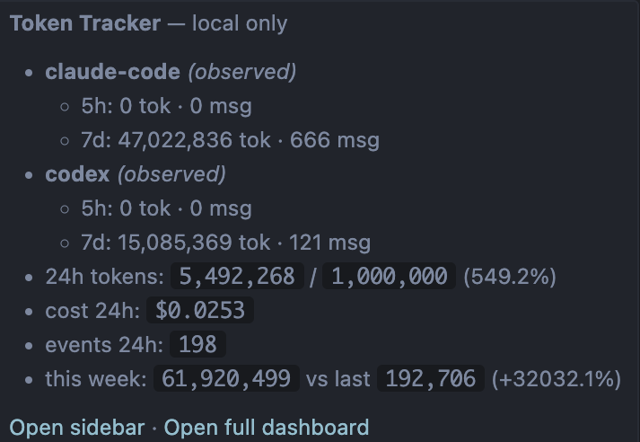
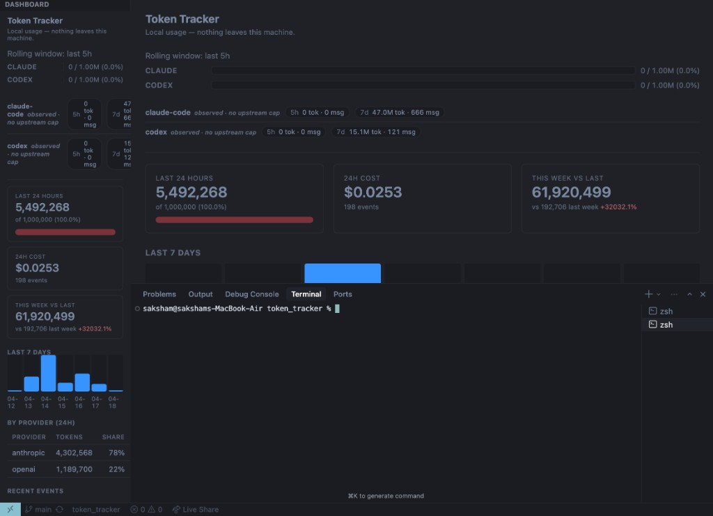

# Token Tracker
> Get realtime token usage of your CLI agents (claude and codex)
> Free, open-source, **local-only** LLM token usage tracker for VS Code and Cursor.

## Dashboard

Status bar + sidebar/editor views:






- **Status bar meter**: rolling 24-hour tokens vs `tokenTracker.dailyTokenLimit`
- **Sidebar + editor dashboard**: 7-day chart, weekly comparison, per-provider table, live event feed
- **Source bars (Claude/Codex)**: rolling **last 5 hours** usage bars, each with independent limits
- **Rate-limit section**:
  - Codex: authoritative windows when rollout metadata is present
  - Claude: observed fallback windows (`5h` / `7d`) from local usage only
- **Local ingest API**: POST to `http://127.0.0.1:58417/ingest`
- **No backend, no account**: data stays on-device in extension storage

---

## Install from source

### Prereqs

- Node >= 18.18
- `pnpm` >= 9 (`npm i -g pnpm`)

### 1) Clone and build/package

```bash
git clone https://github.com/your-org/token-tracker.git
cd token-tracker
pnpm install
pnpm package:ext
# -> apps/extension/token-tracker.vsix
```

### 2) Install into VS Code or Cursor

```bash
# VS Code
code --install-extension apps/extension/token-tracker.vsix

# Cursor
cursor --install-extension apps/extension/token-tracker.vsix
```

Reload the window after install.

---

## Commands

From Command Palette:

| Command | What it does |
| --- | --- |
| `Token Tracker: Open dashboard in editor` | Opens full dashboard webview panel |
| `Token Tracker: Focus sidebar` | Focuses Token Tracker sidebar view |
| `Token Tracker: Refresh` | Re-renders the status bar |
| `Token Tracker: Report usage event (programmatic)` | Programmatic ingest command |
| `Token Tracker: Export events to JSON` | Exports full local event history |
| `Token Tracker: Clear event history` | Deletes all stored events (with confirmation) |

---

## Settings

| Setting | Default | Notes |
| --- | --- | --- |
| `tokenTracker.dailyTokenLimit` | `1000000` | Global status-bar 24h meter limit; set `0` to hide meter |
| `tokenTracker.dailyTokenLimitClaude` | `1000000` | Claude source bar limit in dashboard (rolling 5h usage) |
| `tokenTracker.dailyTokenLimitCodex` | `1000000` | Codex source bar limit in dashboard (rolling 5h usage) |
| `tokenTracker.enableLocalIngest` | `true` | Enables loopback HTTP ingest server |
| `tokenTracker.localIngestPort` | `58417` | Ingest port (binds to `127.0.0.1` only) |
| `tokenTracker.claudeCode.enabled` | `true` | Watches `~/.claude/projects/**/*.jsonl` for Claude Code usage |
| `tokenTracker.codex.enabled` | `true` | Watches `~/.codex/sessions/**/*.jsonl` for Codex usage + limits |

---

## Automatic watchers

### Claude watcher

- Watches `~/.claude/projects/**/*.jsonl`
- Ingests assistant message token usage
- Claude local logs currently do not expose authoritative plan/quota/reset fields
- Emits observed fallback windows:
  - `5h` (rolling)
  - `7d` (rolling)

### Codex watcher

- Watches `~/.codex/sessions/**/*.jsonl`
- Ingests per-turn token usage (`last_token_usage`)
- Uses authoritative `rate_limits` metadata when present (`used_percent`, `window_minutes`, `resets_at`, `plan_type`)
- Falls back to observed `5h`/`7d` windows when metadata is missing

---

## Programmatic ingest

### From another extension

```ts
await vscode.commands.executeCommand("tokenTracker.reportUsage", {
  provider: "openai",
  model: "gpt-4o",
  input_tokens: 1234,
  output_tokens: 567,
  // optional:
  cached_tokens: 0,
  cost_usd: 0.0123,              // if omitted, estimated from apps/extension/src/shared/pricing.ts
  source: "my-extension",        // free-form source label
  client_event_id: "retry-safe-id",
  occurred_at: new Date().toISOString(),
});
```

### From any local process

```bash
curl -X POST http://127.0.0.1:58417/ingest \
  -H 'content-type: application/json' \
  -d '{"provider":"anthropic","model":"claude-opus-4-6","input_tokens":1200,"output_tokens":400}'
```

Optional health check:

```bash
curl http://127.0.0.1:58417/healthz
```

---

## Data model notes

- Event history is stored locally in extension global storage as newline-delimited JSON (`events.ndjson`)
- Status bar uses a rolling **24h** aggregate
- Source bars for Claude/Codex use rolling **5h** aggregate
- Rate-limit windows may be authoritative (Codex metadata) or observed fallback (Claude and Codex fallback)

---

## Project layout

```text
apps/
  extension/    VS Code/Cursor extension (TypeScript + esbuild)
```

## License

MIT — see [LICENSE](./LICENSE).
